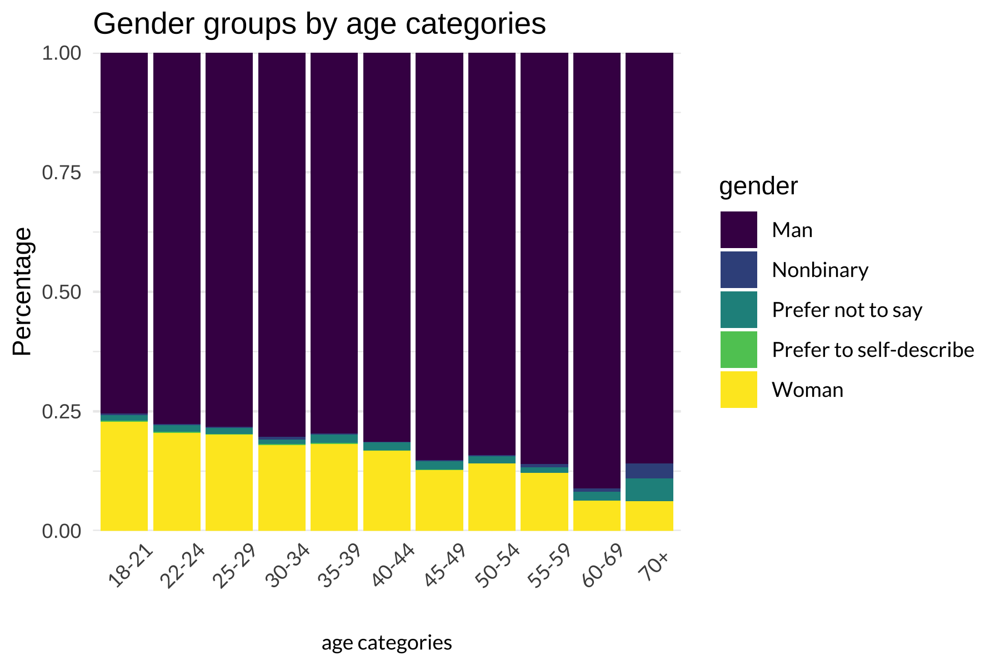
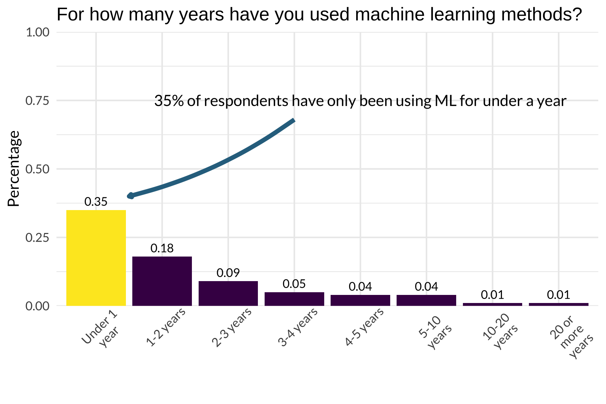
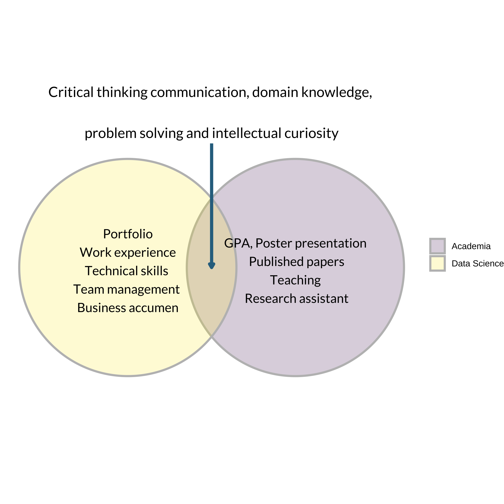

```{r setup, include=FALSE}

knitr::opts_chunk$set(echo = FALSE, message = FALSE, warning = FALSE)
library(dplyr)
library(ggplot2) 
library(magrittr)
library(forcats)
library(tidyr)
library(kableExtra)
library(emoji)
library(ggforce)
library(scales)
library(ggthemes)
library(viridis)
library(viridisLite)
library(showtext)

```


Welcome!
===================================================

So you're thinking about leaving the comforting womb of university, and transitioning to a data science career in industry? You may be feeling....

> - Overwhelmed by the possibilities
> - Confused about the terminology
> - Insecure about your capacities
> - And so many more emotions 

Why {#why}
====================================================


Objectives {#objective}
===================================================

I'll do my best to address these objectives in the most data-driven approach I can!

> - Dispel some myths about the data science industry 
> - Tips on how to transition
> - Let's talk about your CV, the job search and the interview
> - New directions in the data science industry
> - Bestow some glimmer of hope `r emoji("star")`


A bit about me
===================================================

I'm the CEO of a health data science startup in Montreal
www.precision-analytics.ca

```{r me, out.width= "20%", out.extra='style="float:right; padding:10px"'}

```

**My background**

- BA Psychology, Concordia
- MSc Psychology, Université de Montréal 
- PhD Epidemiology and Biostatistics, McGill 

**Our company**

- Founded in 2017
- Blend of statistical consultancy and custom software solutions
- Work in the biopharmaceutical sector to create tools that combine data storage, analysis and communication

```{r pa_log, out.width = "30%", fig.align='center'}

```


Our story {#story}
===================================================


What is a data scientist
===================================================

A combination of programming, statistics and domain knowledge. 

I like to think of it as *story telling using data*

```{r ds_fig, out.width = "35%", fig.align='center'}

```


A very scary (and real) job posting {.smaller}
===================================================


> - Coding knowledge and experience with several languages: C, C++, Java, JavaScript, etc.
> - Knowledge and experience in statistical and data mining techniques: GLM/Regression, Random Forest, Boosting, Trees, text mining, social network analysis, etc.
> - Experience querying databases and using statistical computer languages: R, Python, SLQ, etc.
> - Experience using web services: Redshift, S3, Spark, Digital Ocean, etc.
> - Experience creating and using advanced machine learning algorithms and statistics: regression,
simulation, scenario analysis, modeling, clustering, decision trees, neural networks, etc.
> - Experience analyzing data from 3rd party providers: Google Analytics, Site Catalyst, Coremetrics, Adwords, Crimson Hexagon, Facebook Insights, etc.
> - Experience with distributed data/computing tools: Map/Reduce, Hadoop, Hive, Spark, Gurobi, MySQL, etc.
> - Experience visualizing/presenting data for stakeholders using: Periscope, Business Objects, D3, ggplot, etc.


Myths about data science {#myths}
====================================================


> - Myth 1. You need a PhD to become a data scientist 


> - Myth 2. All data scientists use Python


> - Myth 3. Data science == AI & machine learning


> - Myth 4. Data science is all about technical skills 


Letting the data speak! {.smaller}
===================================================
To tackle these myths, Kaggle conducts an annual survey of data scientists. Over 25,000 respondents completed the survey in 2021

```{r respondent_fig, out.width= "45%", fig.align='center'}

```
`r emoji("bangbang")` Kaggle is a platform that hosts machine learning competitions. It's users are not representative of the entire data science community `r emoji("bangbang")`

Data available for [2021](https://www.kaggle.com/c/kaggle-survey-2021), along with survey and results.   

Demographics of respondents 
=====================================================

```{r demo-fig, out.width= "65%", out.height= "60%"}



```

Types of data scientist positions
===================================================

```{r position-fig, out.width= "65%", out.height= "60%"}

knitr::include_graphics("figs/position_fig.png")

```


Myth 1. You need a PhD to become a data scientist
====================================================

```{r phd_fig, out.width= "65%", out.height= "60%"}

```


Experience of respondents 
====================================================

```{r coding-fig, out.width= "65%", out.height= "60%"}


```


Myth 2. Primary tools used at work or school 
===================================================


```{r tool-fig, out.width= "65%", out.height= "60%"}


```

Myth 3. Data science == Machine learning and AI {.flexbox .vcenter}
==================================================


```{r mlyears_fig, out.width= "65%", out.height= "60%"}

 

```


Myth 4. Data science challenges are mostly analytical 
==================================================

The survey did not explicitly ask the way respondents broke up their time. So I did the next best thing... ask twitter

```{r tweet_fig, out.width = "50%", fig.align='center'}

```

Data scientists challenges {.smaller}
=================================================

In 2017, the Kaggle survey asked respondents about the "biggest challenges in data science".

From here we can  see that most people identify "dirty data" the toughest part of the job. The rest of the issues seem be organizational. 

```{r challenges, out.width="50%"}

```

On transitioning {#transition}
=================================================

<div style="font-weight:bold;font-size:70px;color:black;position: fixed; top:40%; text-align:center;left:25%;padding:1em;">On transitioning</div>


Understand your new "audience"
==================================================

`r emoji("moneybag")` The currency in academia versus the currency in the private sector `r emoji("moneybag")`


```{r venn-diagram, out.width= "45%", out.height= "40%", fig.align='center'}



```


Gaining  more  experience: Courses 
=================================================

The American Statistical Association held a two-day Data Science summit. 72 educators, researchers and practitioners in statistics, mathematics, computer science, and data science from academia, industry, government and nonprofit gathered to put forth recommendations for future data science programs. 

Data science courses should expose students to: 

```{r what-to-learn}
rbind("Introduction to statistics", "
           Data analysis in the real world", 
           "Math and algorithms", 
           "Answering real problems", 
           "Expose students to modern tools", 
           "Teach data ethics", 
           "Active learning") %>% 
  kable() %>% 
  kable_styling(bootstrap_options = c("hover", "condensed", "striped"), font_size = 20)
```

I'd add to this list: study design. Knowing how data was generated/collected will always inform the types of questions you can ask, and appropriate method of analysis. 


Build a portfolio
=================================================

**Showcase your work**

- [Github](https://github.com/)
- a simple personal website 
- [Kaggle competitions](https://www.kaggle.com/)

**Internship**

- Get  relevant experience, learn about new industry, create a network
- Check out your university coop programs 
- Internship programs in industry [IVADO labs](https://ivado.ca/en/events/ivado-digital-intelligence-internship-and-job-fair-h2020/?utm_source=MTL+NewTech&utm_campaign=d8a1232165-EMAIL_CAMPAIGN_2019_06_20_02_54_COPY_01&utm_medium=email&utm_term=0_c6228f9f7d-d8a1232165-444123085&mc_cid=d8a1232165&mc_eid=4ec14ee0c5), [Plotly](https://boards.greenhouse.io/plotly)
- Think Tanks [Rand opportunities](https://www.rand.org/about/educational-opportunities/gsap.html) and [here](https://www.rand.org/about/educational-opportunities.html)


*Don't forget to reach out to your network and tell people you're looking to get into a new industry*


Preparing your cover letter and CV
=================================================


> - Use the cover letter to explain *why* you're applying for the job even if your profile doesn't perfectly match the job description
> - Instead of focusing on all the highlights of your academic career, explain WHY you want to work for THAT company

>- In general, keep it short and sweet (max 2 pages)
> - Academic CV != Professional CV
> - Only provide extensive details about academic experience if it is relevant
> - Tailor your CV and cover letter to each application - use key words from posting


More on CV's 
=================================================

A few tips (based on my personal pet peeves)

> - Use consistent formatting
> - If using a job aggregator site, upload your actual CV (the printout we see is very ugly)
> - Don't include abbreviations or technical jargon
> - Don't indicate that you have high proficiency in 22 programming languages
> - Don't list 30 MOOC's I *know* you didn't finish


Searching for a position
=================================================

```{r shame, out.width= "40%", out.extra='style="float:right; padding:10px"'}

```

> - Focus on the skills listed in the job positing, not the title *but be weary of descriptions* 

>- Widen your search beyond "data scientist" - many analogous positions exist with different titles: analyst, bio/statistician, health economist, R/SAS/Python programmer, technical research assistant, quantitative scientist, consultant ect.

> - Don't expect that you will possess 100% of the stated skills; it's often a wishlist
> - Try to talk to people (ideally former employees) to get insider perspective 


> - Be aware that many companies are jumping on the "data" bandwagon without having any infrastructure to support a junior hire


During the interview
==================================================

- Expect technical questions and/or coding challenge
- Be honest about your skills
- Be mindful about expressing your desired to be paid to learn 
- Highlight the value you bring to the employer, rather than the value you accrued in university
- Be ready to show that you are able to explain technical concepts to non-technical audiences

Jacqueline Nolis's book [Build a Career in Data Science](https://www.manning.com/books/build-a-career-in-data-science)

>"I want to hear about a project they’ve worked on recently. I ask them about how the project started, how they determined it was worth time and effort, their process, and their results. I also ask them about what they learned from the project. I gain a lot from answers to this question: if they can tell a narrative, how the problem related to the bigger picture, and how they tackled the hard work of doing something".

Asking for feedback after your interview can help highlight the interviewer's perceptions of your strengths and weaknesses

Employer fears
==================================================

In general, employers are concerned that new hires without job experience will struggle to see the bigger picture and keep up with the pace. 


```{r fears, out.width= "65%", out.height= "60%", fig.align='center'}

cbind("Undergrad & Masters" = c("No revelant practical experience", 
                                "Will expect a lot of  hand holding", 
                                "Training is expensive and time consuming", 
                                "New grads tend to get trained and then leave"),
      "PhD" = c("Experience is hyperfocused", 
                "Unaccustomed to working collaboratively in multidisplinary teams",
                "Both under- and over-qualified", 
                "Understimulated by day-to-day")) %>%
  kable(format = "html") %>% 
  kable_styling(bootstrap_options = c("striped", "hover", position ="float_right",
                                      font_size = 30)) %>% 
  row_spec(0, color = "#453781FF")


```

>**Try to address these fears explicitly in your cover letter, CV and/or during the interview**

Conclusion
===================================================


```{r ds_venn, out.width = "40%", out.extra='style="float:right; padding:10px"'}


```

Pivoting to data science  from humanities, social sciences or any other disciplines doesn't mean you need to leave all of your training behind. 

`r emoji("check")` You have knowledge and/or experience in at least one of these circles 

`r emoji("check")` Look for people in your substantive area who are doing some more quantitative/tech driven work

`r emoji("check")` Be confident that *you* know how to learn

`r emoji("check")` Be ready to rebrand yourself 

`r emoji("check")` Be ready to be creative in your search and to be a hustler 

`r emoji("check")` Your path is the right path 


New directions (my hot takes)
===================================================

> -  Large push towards "automating" analytics is set to change the role of data scientists (e.g. Data Robot, Alteryx, Dataiku, Google Cloud AI) but storytelling and substantive expertise cannot be productized 


> - Many organizations want to innovate but are not sure how; many ML investments have failed to deliver value  

> - In the healthcare sector, billions invested in AI for drug discovery but not a single drug has gone to market 

> - Bigger data and more computing power are only useful if we have the right data to ask the useful question


A big thanks!
===================================================


I can be found on [twitter](https://twitter.com/ea_braithwaite) @ea_braithwaite

Come check out our website [www.precision-analytics.ca](www.precision-analytics.ca)

This presentation & R code can be found online [https://github.com/precision-analytics/CAnD3](https://github.com/precision-analytics/CAnD3).

Simply download the entire repo via "clone/download" button; the presentation  is the html file

```{r r_logo, out.width = "15%", fig.align='center'}
knitr::include_graphics("figs/R_logo.png")
```

Happy to answer any questions {#questions}
============================================


